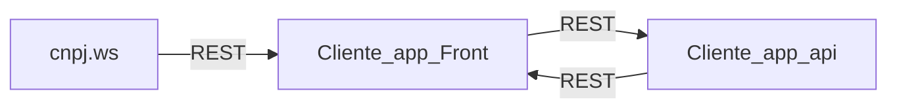

# Projeto: Controle de Dados de Cliente (Cliente_app_api)

Este projeto é um sistema de controle de informações de clientes desenvolvido para gestão eficiente de dados. O sistema é composto por 3 componentes básicos que se comunicam utilizando REST de acordo com o fluxograma abaixo

Sendo:

**[Cliente_app_apih](https://github.com/RafFerOli/Cliente_app_api/blob/main/Cliente_app_api/README.md)**:  uma API Web para controle de dados.
**[Cliente_app_front](https://github.com/RafFerOli/Cliente_app_front/blob/main/Cliente_app_front/README.md))**:  uma interface para interação do usuário;
**[cnpj.ws](https://www.cnpj.ws/docs/intro)**:  uma API Web externa para aquisição de dados através do cnpj;

## Estrutura da API :

**Cliente_app_api**
A API é construída em Python, utilizando o framework Flask para criar endpoints robustos e escaláveis para interagirem com a tabela "Cliente" que se encontra em um banco de dados "SQlite". O sistema utiliza o framework "SQLAlchemy" para trabalhar com as informações principais e conta com a documentação em "Swagger", além disso, o diretório da aplicação também possui um arquivo de configuração "Dockerfile" para realização de testes.

**Cliente_app_front**
A interface de operação do usuário é construída em HTML, CSS e JavaScript. Nela o usuário tem a possibilidade de castrado de dados do cliente, visualização de informações principais, alteração de dados, pesquisa, busca de localização através das informações cadastradas e busca de dados para cadastro através do C.N.P.J.

**cnpj_ws**
A API do CNPJ.ws disponibiliza de maneira simples e rápida dados sobre empresas brasileiras através do número do CNPJ. Esses dados são obtidos junto aos orgãos públicos como a SEFAZ, CADESP, Sintegra, Suframa e organizados de maneira a permitir o máximo de informação possível visando ampliar as possibilidade de uso desses dados.

## Tecnologias Utilizadas:

   **Python:** Linguagem de programação utilizada para o desenvolvimento da API.
   **HTML:** Linguagem de programação utilizada para o desenvolvimento da interface.
   **CSS:** Linguagem de programação utilizada para o desenvolvimento da interface.
   **Javascript:** Linguagem de programação utilizada para o desenvolvimento da da interface.
   **Flask:** Framework web leve e flexível para criar endpoints RESTful.
   **SQLAlchemy:** Framework para interagir com o banco de dados SQL de forma simplificada.
   **SQLite:** Banco de dados embutido para armazenamento de dados de forma eficiente e confiável.

## Benefícios:

   **Automatização:** Reduz a necessidade de tarefas manuais na gestão do dados de cliente, economizando tempo e recursos.
   **Transparência:** Oferece uma visão clara e transparente das informações dos clientes empresa, facilitando a tomada de decisões.
   **Facilidade de Uso:** Interface intuitiva e amigável para facilitar o uso por parte dos usuários, mesmo aqueles com pouca experiência técnica.

Com essa API, deseja-se fornecer às pequenas empresas uma ferramenta poderosa para gerenciar os dados de forma eficiente, ajudando no crescimento e sucesso contínuo de seus negócios.
